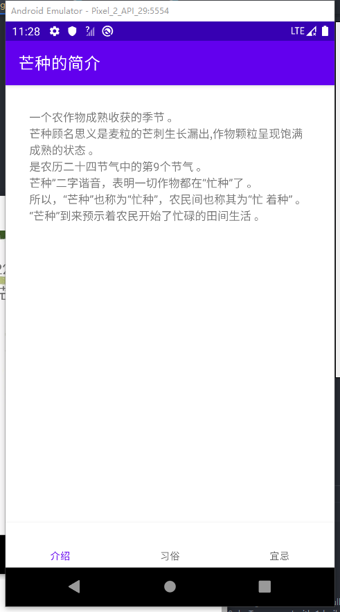

#  SolarTerm

一个关于二十四节气的Android App

## 硬件需求

一台Android 8.1及以上的SoC使用arm-v8a架构的手机

## 安装

从Release下载最新的apk，安装。

## 介绍

主页面：

节气：

菜单：

节气的介绍：

## 特色

每个节气的页面有一张、节气的简介和一句随机的关于该节气的诗句（均由负责资源收集的同学从网络上找下来）

可以左右滑动切换节气，没有丑陋的按钮（简洁的美！）

占用较低，Apk仅15MB，大部分为背景动图。

不会申请任何权限。

## 学科结合

计算机：应用制作

语文：诗句

历史：简介、习俗中的部分

美术：挑选动画、UI设计
